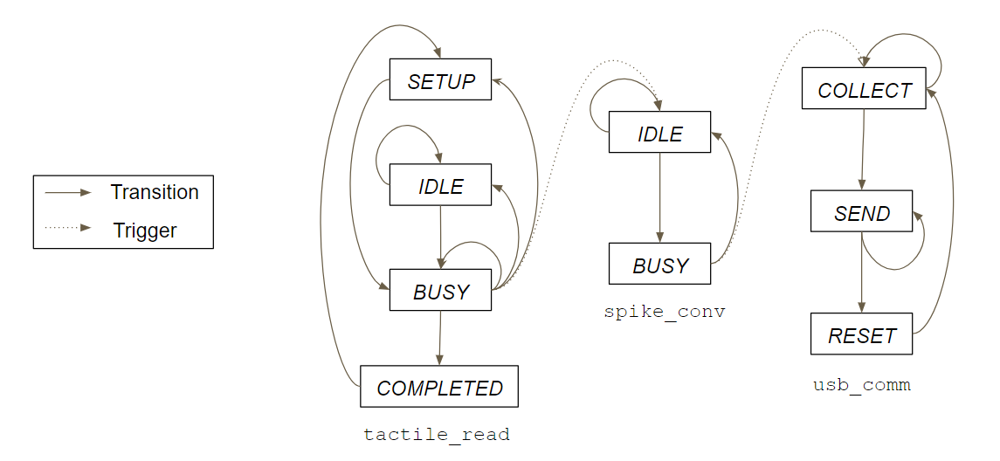

# 3D Shape Recognition for Neuromorphic Tactile Sensing
This repository contains the code for my project at SINAPSE, National University of Singapore during May-July 2018 as a part of my research internship under the guidance of Prof. Alcimar Soares.

This codebase can be broadly classified into the following sections:
* [Firmware](#firmware)
* [User Interface](#gui)
* [Deep Learning algorithm](#deep-learning-algorithm)

## Firmware
This section contains the firmware (resides [here](MainController_new)) for reading neuromorphic data from four 4x4 piezoresistive tactile sensors using a STM32F103C8 microcontroller. It was written in **C** and developed using TrueSTUDIO and STM32CubeMX. I have used *three* **state machines** for accomplishing this task, namely `tactile_read`, `spike_conv` and `usb_comm`, governed by the following state diagram

### Description of SMs
* **tactile_read :** Reads digital values by scanning 10 ADC channels after appropriately configuring two multiplexors. 
* **spike_conv :** Converts the read values into spike events by using an *integrate-and-fire* neuron model.
* **usb_comm :** Transfers the spike activity information to the backend computer at high speed via the USB port.

## User Interface

## Deep Learning Algorithm
