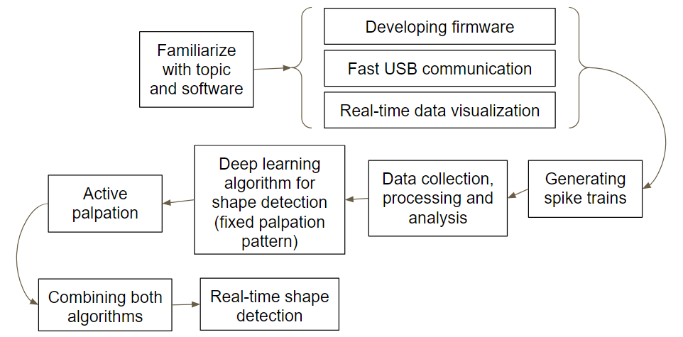

# 3D Shape Recognition using Neuromorphic Tactile Sensing
This repository contains the code for my project at SINAPSE, National University of Singapore during May-July 2018 as a part of my research internship under the guidance of Prof. Alcimar Soares.

#### Contents
* [Abstract](#abstract)
* [Plan of action](#plan-of-action)
* [Ideation](#ideation)
* [Firmware](#firmware)
* [User Interface](#user-interface)
* [Deep Learning algorithm](#deep-learning-algorithm)

## Abstract
The main aim of my project was to design a deep learning architecture for *three-dimensional shape recognition* based on neuromorphic data collected from tactile sensor arrays mounted on a prosthetic hand, and to create a framework for real-time shape recognition.

We used neuromorphic tactile sensors based on the *piezoresistive principle* to encode changes in pressure as spike events at each sensing element, and used a set of such spike streams to deduce the shape of the object being palpated. The responses of neuromorphic sensors resemble spikes from neurons in the human skin, and provide an efficient way to encode only the necessary information for further processing. 

During this internship, we developed a deep learning model to extract information from the stream of spikes and generalize it according to the object being grasped. We also endeavored to design an algorithm to dynamically determine the manner in which the object needs to be palpated in order to maximize information gain for shape recognition (i.e *active palpation*).

## Plan of action


## Ideation
Earlier approaches used *softmax classifiers* and *extreme learning machines* (ELMs) for the task of texture recognition, and were able to obtain decent accuracy for the same. I plan to use a combination of **Convolutional Neural Networks** and **Recurrent Neural Networks** for the purpose of shape recognition.

CNNs and RNNs are effective in extracting spatial and temporal correlation and patterns respectively. We can use the spike data to generate a 2D heat-map representing the pressure measured by each sensing element at a given instant (ie. for a given palpating position), and then extend this information across time by generating similar maps for other palpating positions. Since this information has both spatial and temporal aspects, a combination of CNN and RNN (similar to that used for video classification) could be a good approach for tackling the problem. We could use independent models for each tactile sensor (ie. a separate model for each finger) and then combine their predictions using a classifier to get the final output (recognized shape).

## Firmware
This section contains the firmware (resides [here](MainController_new)) for reading neuromorphic data from four 4x4 piezoresistive tactile sensors using a STM32F103C8 microcontroller. It was written in **C** and developed using TrueSTUDIO and STM32CubeMX. I have used *three* **state machines** for accomplishing this task, namely `tactile_read`, `spike_conv` and `usb_comm`, governed by the following state diagram


### Description of SMs
* **tactile_read :** Reads digital values by scanning 10 ADC channels after appropriately configuring two multiplexors. 
* **spike_conv :** Converts the read values into spike events by using an *integrate-and-fire* neuron model.
* **usb_comm :** Transfers the spike activity information to the backend computer at high speed via the USB port.

## User Interface

## Algorithm

### Data preprocessing
In order to generate the training data (`.pcd` files for point clouds)
```
$ cd 3D_models
$ python -i generate.py 
>>> generate_data(num_samples=1000, min_pts=50, max_pts=150)
```
For extracting point-of-view images from the generated data
```
$ cd scripts
$ python extract_pov.py ../3D_models ../save
```
For converting the PoV images to `numpy` arrays for training
```
$ cd shape_recognition
$ python preprocess.py ../save
```

