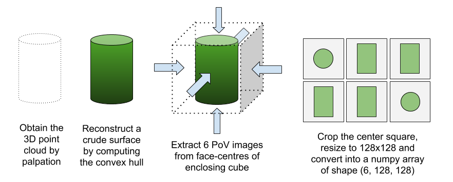
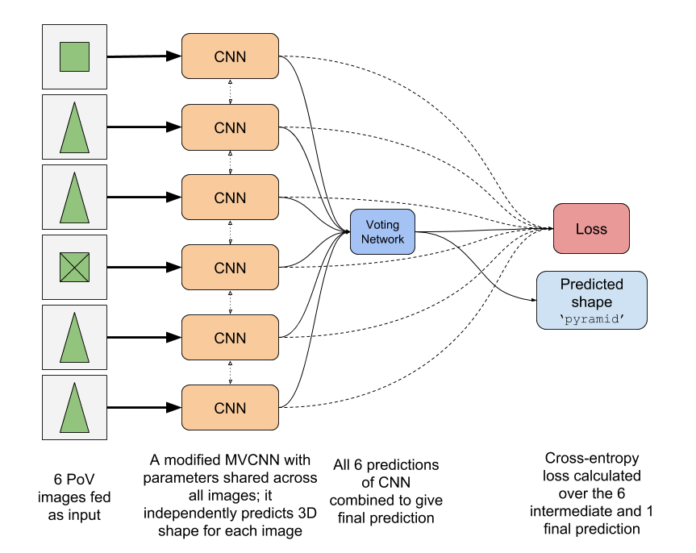
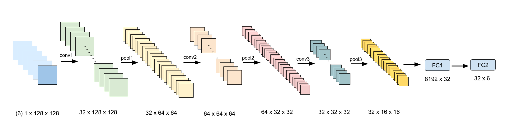

# 3D Shape Recognition using Neuromorphic Tactile Sensing
This repository contains the code for my project at **SINAPSE, National University of Singapore** during May-July 2018 as a part of my research internship under the guidance of **Prof. Alcimar Soares**. I was guided by Andrei Nakagawa and Rohan Ghosh.

#### Contents
* [Abstract](#abstract)
* [Initial plan of action](#initial-plan-of-action)
* [Initial ideas](#initial-ideas)
* [Working plan](#working-plan)
* [Firmware](#firmware)
* [User Interface](#user-interface)
* [Shape Recognition](#shape-recognition)
* [Palpation](#palpation)

## Abstract
The main aim of my project was to design a deep learning architecture for *three-dimensional shape recognition* based on neuromorphic data collected from tactile sensor arrays mounted on a prosthetic hand, and to create a framework for real-time shape recognition.

We used neuromorphic tactile sensors based on the *piezoresistive principle* to encode changes in pressure as spike events at each sensing element, and used a set of such spike streams to deduce the shape of the object being palpated. The responses of neuromorphic sensors resemble spikes from neurons in the human skin, and provide an efficient way to encode only the necessary information for further processing. 

During this internship, we developed a deep learning model to extract information from the stream of spikes and generalize it according to the object being grasped. We also endeavored to design an algorithm to dynamically determine the manner in which the object needs to be palpated in order to maximize information gain for shape recognition (i.e *active palpation*).

## Initial plan of action


## Initial ideas
Earlier approaches used *softmax classifiers* and *extreme learning machines* (ELMs) for the task of texture recognition, and were able to obtain decent accuracy for the same. I plan to use a combination of **Convolutional Neural Networks** and **Recurrent Neural Networks** for the purpose of shape recognition.

CNNs and RNNs are effective in extracting spatial and temporal correlation and patterns respectively. We can use the spike data to generate a 2D heat-map representing the pressure measured by each sensing element at a given instant (ie. for a given palpating position), and then extend this information across time by generating similar maps for other palpating positions. Since this information has both spatial and temporal aspects, a combination of CNN and RNN (similar to that used for video classification) could be a good approach for tackling the problem. We could use independent models for each tactile sensor (ie. a separate model for each finger) and then combine their predictions using a classifier to get the final output (recognized shape).

Thus, these ideas were based on solely using the tactile sensor values for extracting features and recognizing 3D shapes.

## Working plan
After a few weeks of working with the tactile sensors, we realized that using their readings solely for shape recognition wouldn't be beneficial. This was mainly because of *two* reasons
*   **the resolution of the sensors was low.** The 4x4 arrays were not sufficient for capturing features of the object being palpated; since the sensors had to be mounted on fingertips, their small size had to be maintained.
*   **normal estimation using the standard pitch-and-roll method would be crude.** Earlier shape recognition methods used normal information at the points of contact to determine the object's shape. These details were obtained by placing the finger on the surface (pitching) followed by rolling it on either side to estimate the curvature from sensor values.

<center>

</center>

Due to low resolution of tactile sensors, normal estimation using the above method would give crude results. We thus needed a method that depended only on points-of-contact, and not the corresponding normals. We therefore decided to spilt the task into two objectives (very different from before)
1.   formulate an [algorithm](#shape-recognition) for recognizing shape using *only* point clouds
2.   devise an [algorithm](#palpation) for collecting this point cloud by palpating the object

## Firmware
This section contains the firmware (resides [here](MainController_new)) for reading neuromorphic data from five 4x4 piezoresistive tactile sensors using a STM32F103C8 microcontroller. It was written in **C** and developed using TrueSTUDIO and STM32CubeMX. I have used *three* **state machines** for accomplishing this task, namely `tactile_read`, `spike_conv` and `usb_comm`, governed by the following state diagram


### Description of SMs
* **tactile_read :** Reads digital values row-wise by scanning 8 ADC channels after appropriately configuring columns, using three multiplexors. 
* **spike_conv :** Converts the read values into spike events by using an *integrate-and-fire* neuron model.
* **usb_comm :** Transfers the spike activity information to the backend computer at high speed via the USB port.

## User Interface
This was developed by [Andrei](https://github.com/andreinakagawa) and [Saipraneeth](https://github.com/praneeth27). It plotted the tactile sensor values in real-time using three levels of sensitivity (low, medium and high).


## Shape Recognition
As described earlier, the challenge was to develop an algorithm that was simple yet robust to noise which might be introduced due to the low resolution of the sensors. We had to look into methods which didn't use normal information at the points of contact (earlier approaches often relied on this information) and at the same time used minimum number of contact points.

The tactile sensors were used for identifying whether the prosthetic hand was in contact with a surface or not. The object to be recognised was palpated and the coordinates of points of contact were collected. This point cloud was normalized by performing *recentering*, *rotation*, *scaling* and *axes-flipping* operations. We then constructed a crude surface enveloping these points by computing their *convex hull*. 6 point-of-view images were extracted from this surface from the 6 face-centers of the enclosing cube. These images were used as inputs to the deep learning model.



### Data generation and preprocessing

In order to generate the training data (`.pcd` files for point clouds)
```
$ cd 3D_models
$ python -i generate.py 
>>> generate_data(num_samples=1000, min_pts=50, max_pts=150)
```
For extracting point-of-view images from the generated data
```
$ cd scripts
$ python extract_pov.py ../3D_models ../save
```
For converting the PoV images to `numpy` arrays for training
```
$ cd shape_recognition
$ python preprocess.py ../save
```
### Deep Learning architecture


We used a modified **Multi-View Convolutional Neural Network (MVCNN)** introduced by [Hang Su et al](https://arxiv.org/abs/1505.00880) for the task of 3D shape recognition. The first CNN has *three* Conv-Pool layers and *two* Fully Connected layers, each with *leaky ReLU* activation. Instead of using a second CNN for combining the features extracted by the first CNN, we used a much simpler *voting* network, which is basically a feedforward neural network with concatenated predictions as input. This *voting* network essentially combines the independent predictions of the first CNN for the 6 PoV images into a single final prediction. Details regarding the architecture are as below.



For training the model 
```
$ cd shape_recognition
$ python train.py --data_dir data/ --save_dir save/ --batch_size 50 --lr 1e-3 --n_epochs 5 --log_dir logs/
```
`--restore` and `--load_dir` flags can be added for resuming training of a partially trained model.

### Results


## Palpation
